En este minitutorial, responderemos a algunas preguntas empleando QGIS. Nuestra zona de estudio es el estado de Sonora. Las preguntas son: **¿Cuántos municipios tiene el estado de Sonora?¿Cuál es el municipio en Sonora con más bosque y selva?**

**Paso 1. Descarga de los datos.**

SITIO DEL [INEGI](http://www.inegi.org.mx/) \> GEOGRAFIA > TEMAS>MARCO GEOESTADISTICO NACIONAL > Descarga Áreas geoestadísticas municipales.

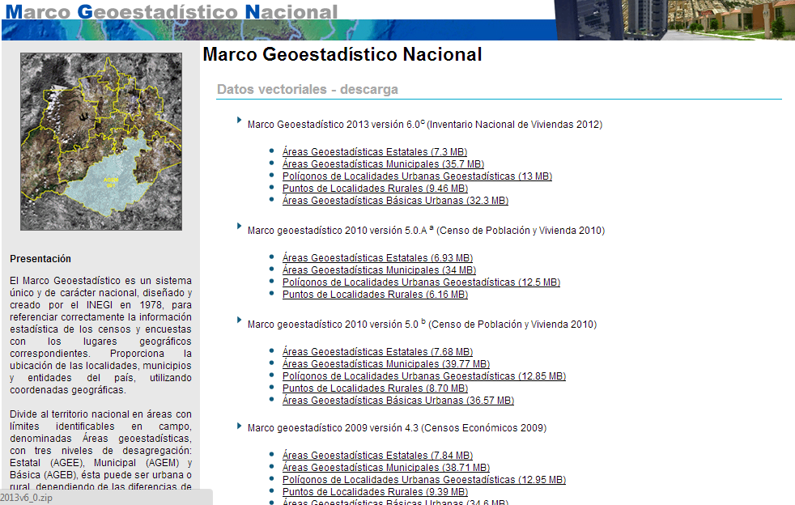

SITIO DEL [INEGI](http://www.inegi.org.mx/) > ESTADISTICA > BANCO DE DATOS > SISTEMA ESTATAL Y MUNICIPAL DE BASES DE DATOS (SIMBAD). El porcentaje de la superficie cubierta por bosque y selva en el año 2005.

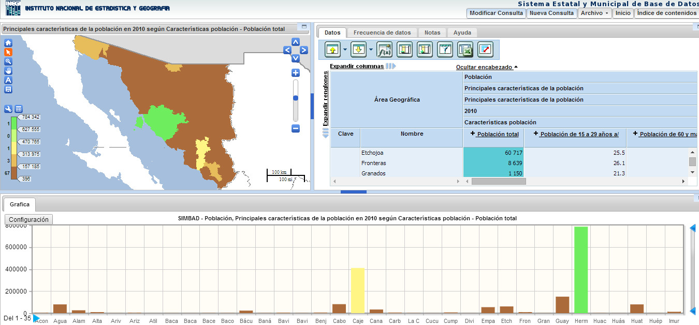

La carpeta con los archivos del marco geoestadístico descomprimido lucirá así: mgm2013v6\_0

La información estadística de población y porcentaje del bosque y selva en unas carpetas parecidas a: SIMBAD\_fdebd\_20140707070505003\_bosqueSelva

**Paso 2. Carga de datos. Ejecuta QGIS.**

MENU> capa> añadir capa vectorial (ctrl + v) o través del icono del menu del lado izquierdo. Agrega el archivo dentro de la carpeta mgm2013v6\_0/municipios\_2013.shp

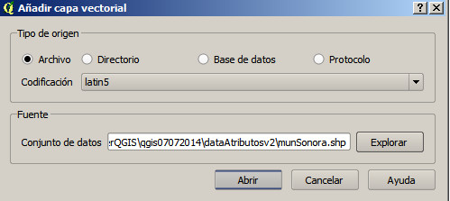

Como vemos, se muestran los municipios de toda la República Mexicana, sólo nos interesan los municipios del estado de Sonora. Para ello, abriremos la tabla de atributos y por medio de una consulta, seleccionaremos aquellos municipios que cumplan con la CLAVE DE LA ENTIDAD igual al valor 26.

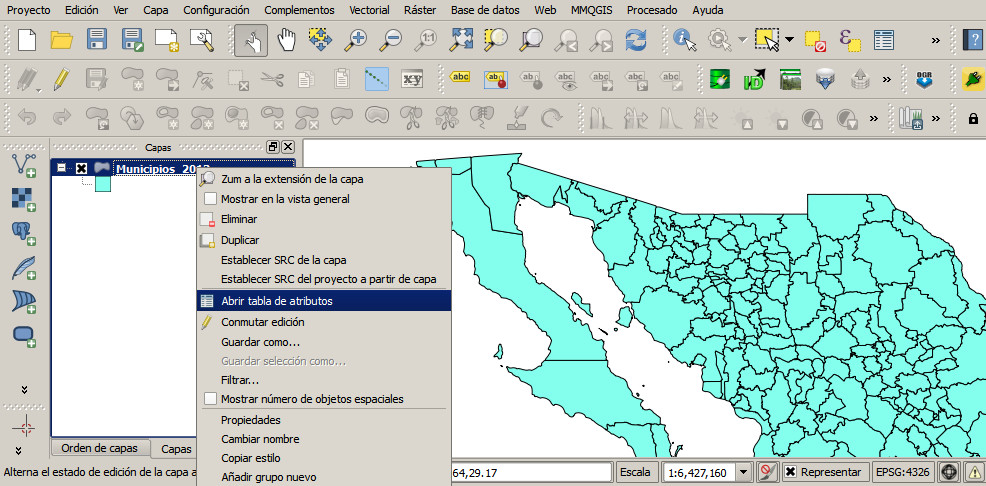

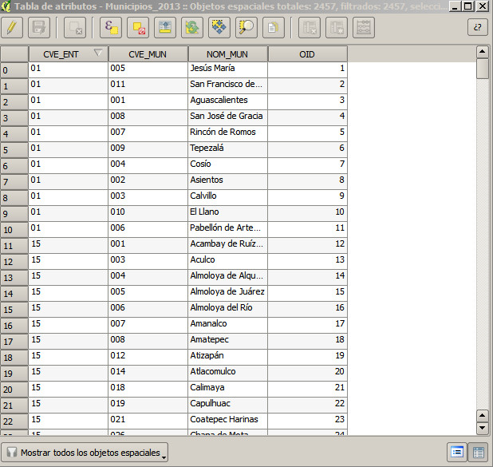

Ahora seleccionaremos por expresión, por medio del icono 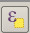 , los municipios correspondientes al estado de Sonora:

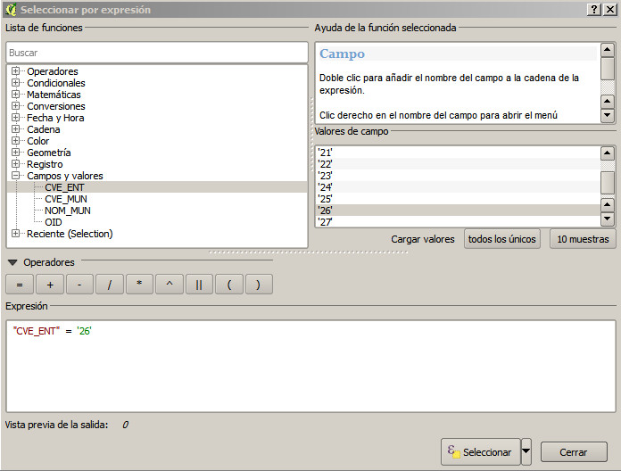

Con los municipios seleccionados, vamos al listado de capas y guardamos la selección como un nuevo archivo llamado **munSonora.shp**

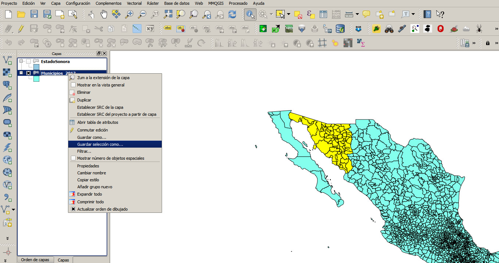

**Paso 3. Hacer una unión (JOIN) con la tabla de bosque y selva de los municipios.**

Hacer la unión (join) de los municipios con la tabla de información de población y superficie de bosque y selva, para ello cargar los archivos descargados que se encuentran en formato de excel, estos los convertiremos en archivos CSV (delimitados por texto). Abrimos en los archivos en un editor de hoja de cálculo y quitaremos los reglones que describen el Área geográfica y características de la información. El archivo deberá lucir así:

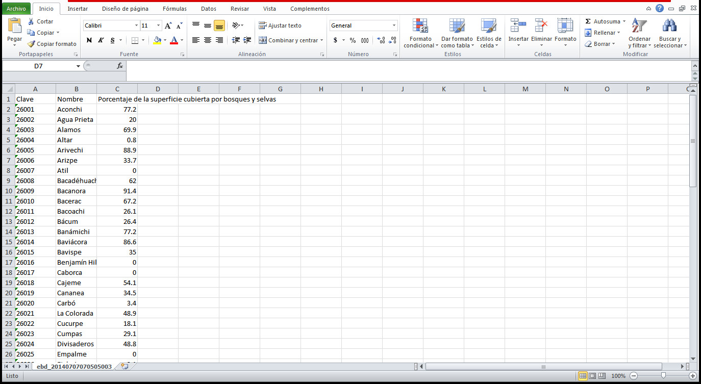

Carga el archivo csv del porcentaje de bosque y selva a QGIS por medio del botón:  del lado izquierdo.

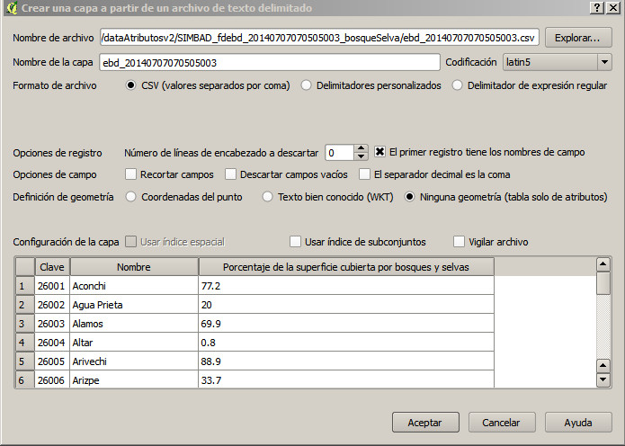

La operación de UNIÓN (JOIN) se selecciona en las propiedades de la capa munSonora.shp (correspondiente a los municipios de Sonora).

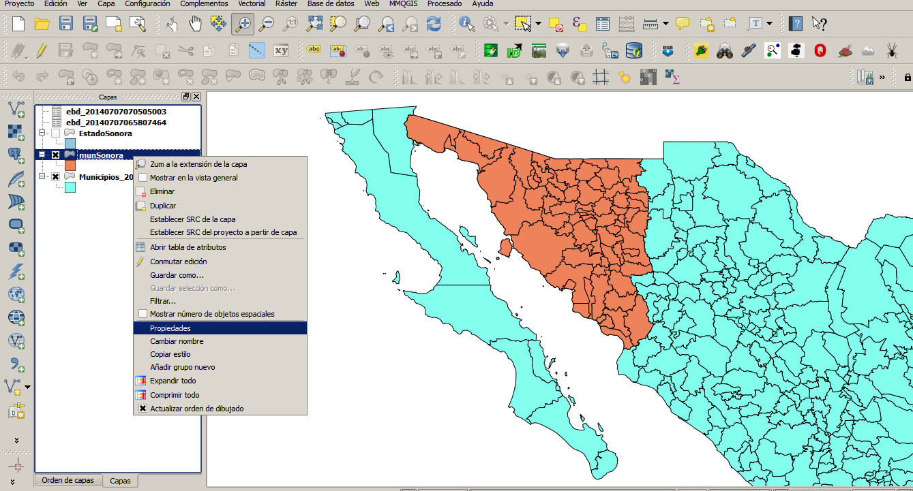

Del menu de propiedades, seleccionamos UNIONES, agregamos una nueva por medio del botón 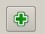 Elegimos el campo en común, esto es, el Nombre del municipio; enlazará polígonos con el mismo identificador del campo de la tabla.

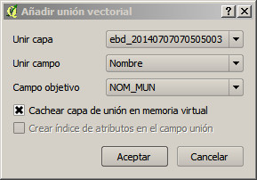

Una forma de verificación es abrir la tabla de atributos de la capa _munSonora_, donde se aprecian los nuevos campos "unidos".

**Paso 4. Respuesta a las preguntas iniciales:**

¿Cuántos municipios tiene el estado de Sonora? El último paso anterior, en el momento de la apertura de la tabla de atributos nos muestra en la parte superior el total de registros que corresponde al total de municipios: 72.

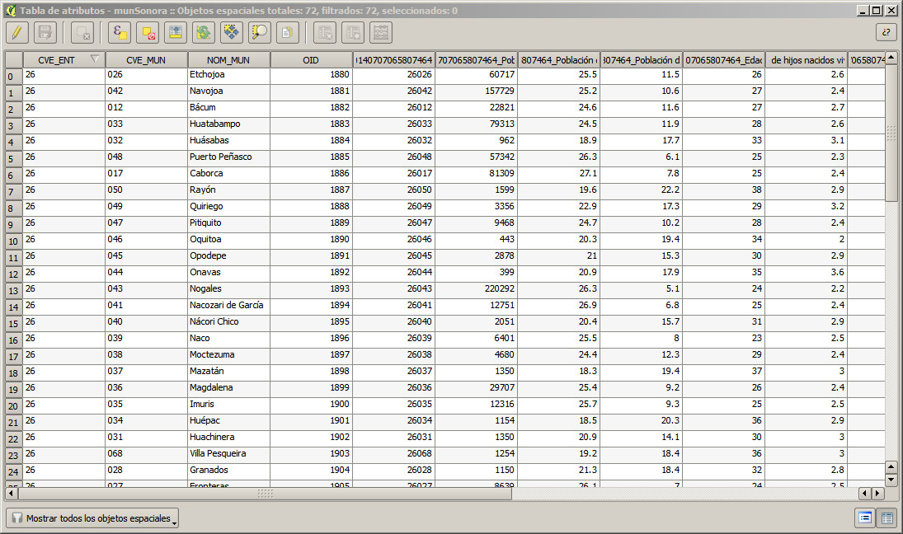

¿Cuál es el municipio en Sonora con más bosque y selva?

Ordena la tabla de atributos, de menor a mayor, dando click en el nombre del campo _**porcentaje de superficie y bosque**_: los municipios de Bacanora, Onavas y La Colorada.

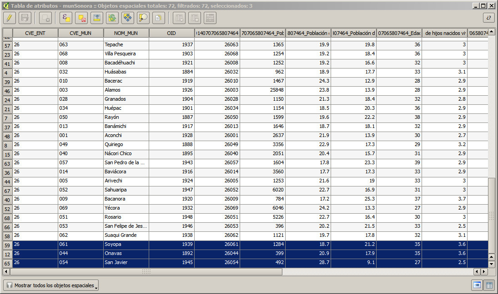

* * *

**Referencias**

INEGI.(2016). Geografía. http://www.inegi.org.mx

Olaya V. (2010). Libro SIG. 911 p.

QGIS Project. (2016). QGIS training manual. 553 p.

Ujaval G. 2014. QGIS Tutorials and Tips. http://www.qgistutorials.com/es/index.html

Taller de mapas.Rancho Electrónico.http://ranchoelectronico.org/

_**Tlazohkamati, cualli ohtli.**_
